# Themer Quickstart

Themer is a powerful and intuitive solution for customizing and creating tenant themes that are perfectly aligned with the Design System.

With Themer, you can easily modify the Default Theme to match your brand's visual identity, create an entirely new theme from scratch, or update an existing theme based on the latest design guidelines.

The modifiable elements include [colors](#generate-color-palettes), [typography](#select-typography), and [object styles](#configure-object-styles)—all with real-time component previews to help you see how the theme looks before you apply it.

## Get started

You don't need specific permissions to access Themer, but you do need to have access to the AdHoc Okta account. Once you open the app, it offers three options:

- **Default Theme** allows you to adapt the current tenant theme to fit your brand's visual identity.
- **Create new theme** allows you to create a new theme from scratch by altering the available elements.
- **Import JSON** allows you to upload and edit an existing theme JSON file.

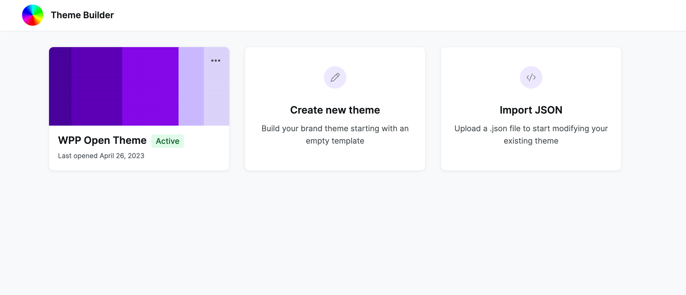

For this quickstart, we are going to focus on creating a theme from scratch. However, the editing process is identical for all three options.

So, select **Create new theme**, give your theme a name, and let's start by adding the necessary [color palettes](#colors).

:::important
Wait to close Themer until you're done working on the theme, as the app doesn't save your progress. If you want to take a break, export the current theme file and then upload it through **Update an existing theme** to continue editing.
:::

## Generate color palettes

In this section, you will create five color palettes for your theme: [primary](#primary), [grayscale](#grayscale), [categorical](#dataviz-categorical) and [sequential](#dataviz-sequential) dataviz, and [system](#system). These palettes are interconnected to establish a cohesive look and feel for your theme.

For more information on how we approach colors in the Design System, see [Foundations: Color](/docs/design-system/foundations/color) and [Data visualization: Select colors](/docs/design-system/data-visualisation/checklist/dataviz-colors).

### Primary

The primary palette is responsible for the majority of components.

#### To create a primary color palette:

1. Select a primary color for your theme.
2. Use [Tints](https://www.tints.dev/red/EF4444) to generate ten shades of your primary color. You can adjust the settings in Tints as you see fit, but make sure that the shades between **primary-400** and **primary-800** are AA+ compliant.

   Preserve the generated values because you will need them for the sequential dataviz palette.

3. Update the **primary-100** to **primary-800** values in Themer, with **primary-500** being your primary color.

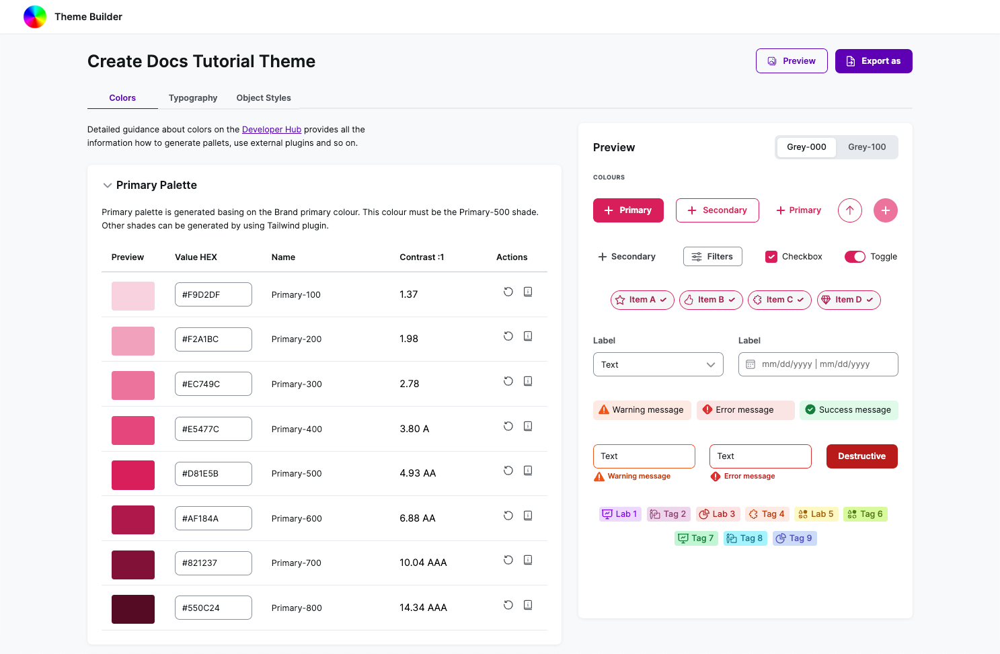

Make sure to check the component preview and adjust the colors as needed.

### Grayscale

We have three pre-defined options for the grayscale palette: cold, neutral, and warm. Choose the one that works best with your primary palette.

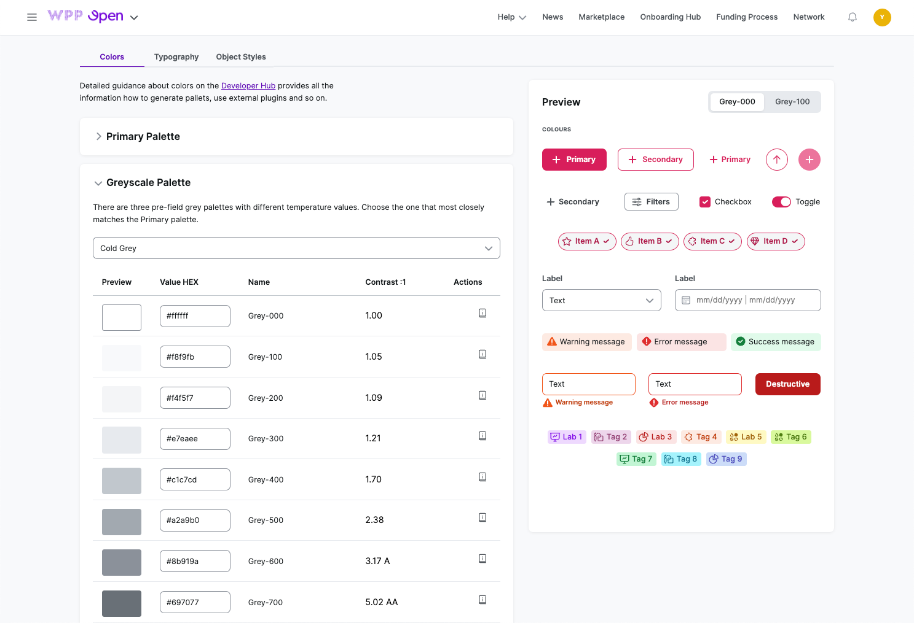

### Dataviz categorical

The categorical dataviz palette is used in data visualization and some UI components across the design system.

#### To generate a categorical dataviz palette:

1. Using [TailwindInk](https://tailwind.ink/), select either the **Lineal** or **Tailwind New** color palettes.

   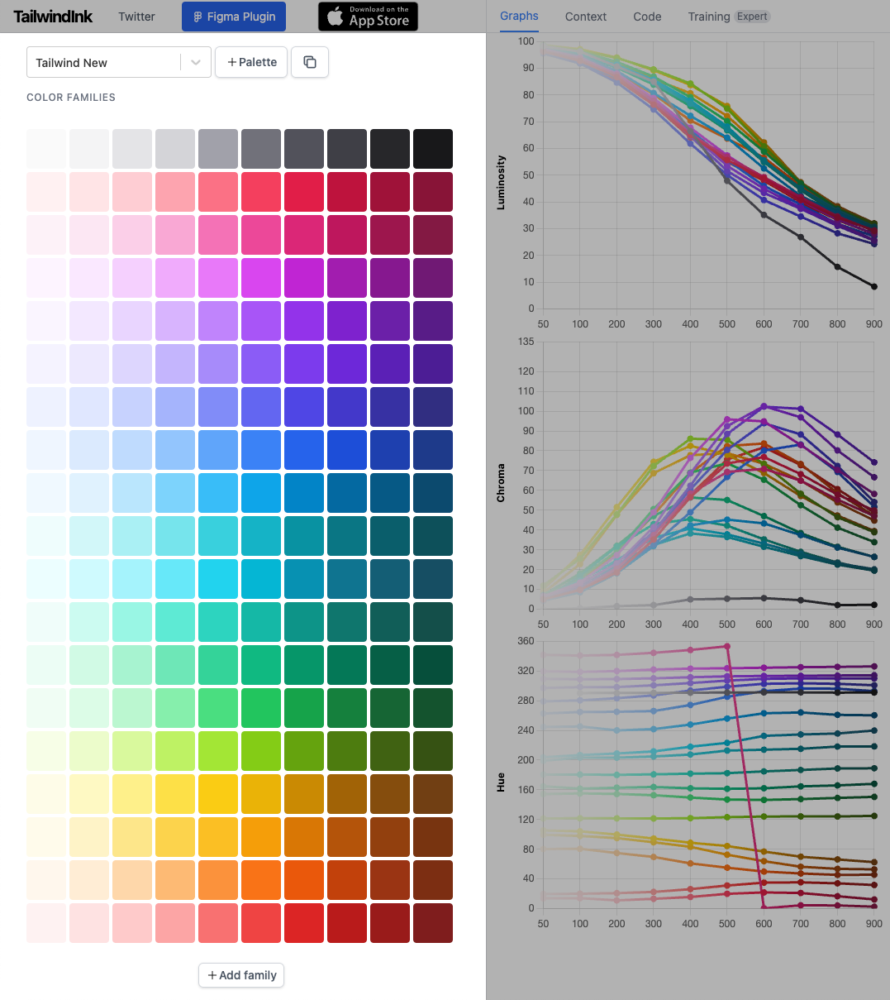

2. Select the **Copy palette** icon to duplicate your initial palette, and then, under **Palette Editor**, select **Enable picker**.

   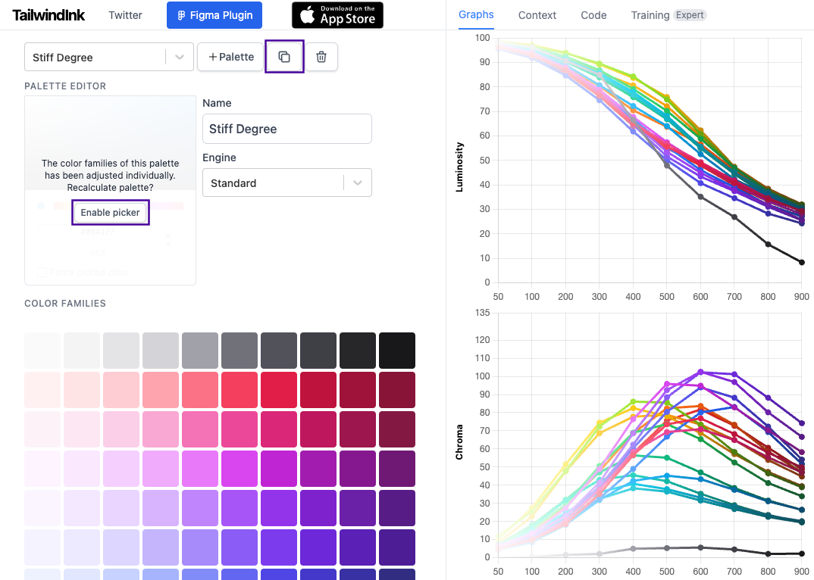

3. In **Palette picker**, enter your **primary-500** value.

   The palette automatically adjusts to the primary color value; your primary color should be the first swatch in the set. If it's not, take a lighter primary shade (**primary-400** or **primary-300**).

   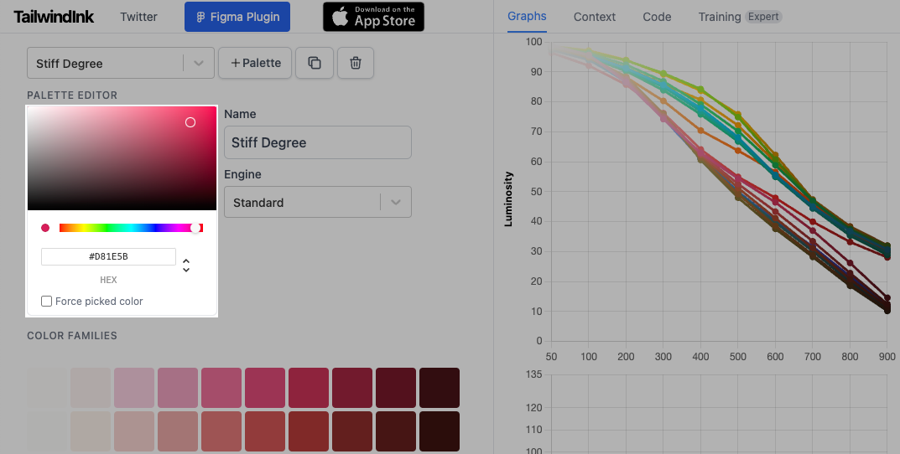

4. From the primary-based palette, select nine swatches: one should be your primary color, and the rest should be distinct from it. From these swatches, you can choose values to fill in your **Dark**, **Light**, and **Neutral** categorical palettes:

   - Take **Light** from the 200 range, **Neutral** from the 400 range, and **Dark** from the 600 range.
   - For **neutral-1**, **light-1**, and **dark-1**, use primary color shades.
   - For **neutral-10**, **light-10**, and **dark-10**, use the grayscale palette.

   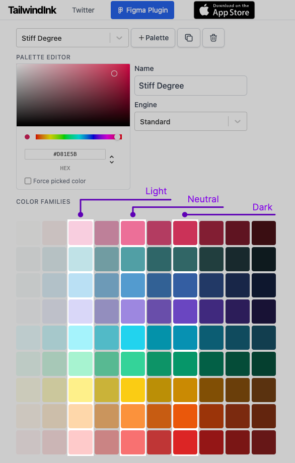

5. Enter the generated values in Themer.

   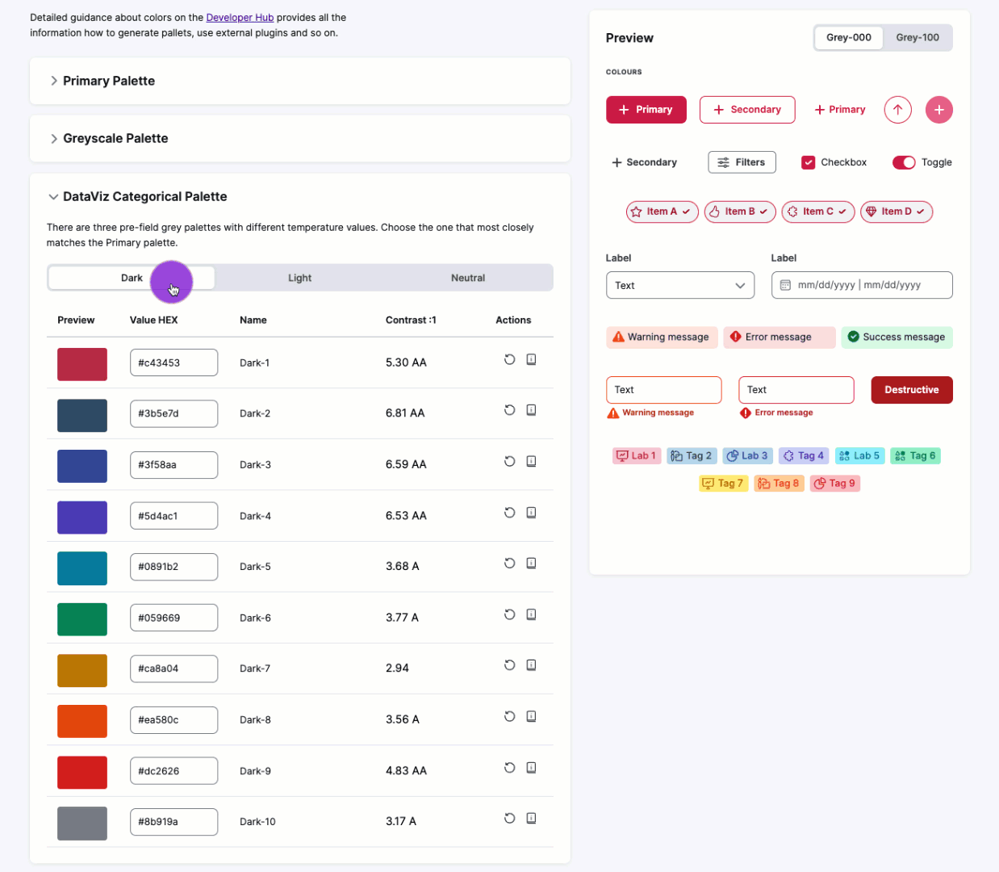

### Dataviz sequential

Use colors from other palettes to generate the sequential dataviz palette based on these guidelines:

- For the **Brand** palette, take your brand shade range from the categorical palette.
- For the **Gray** palette, take the grayscale palette.
- For the **Positive**, **Negative**, and **Warning** palettes, select individual green, red, and orange hues from the categorical palette, and generate 10-shade palettes with [Tints](https://www.tints.dev/red/EF4444). Make sure that these hues are different from your primary color.

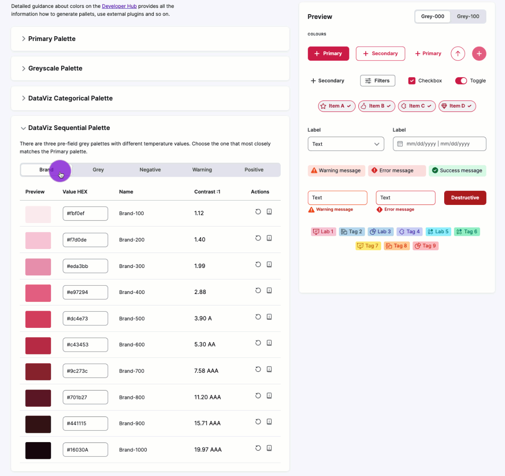

### System

For the system palette, select fitting shades from the categorical palette but ensure they are at least in the AA contrast range. You can check this with a tool like [Coolors](https://coolors.co/contrast-checker/112a46-acc8e5).

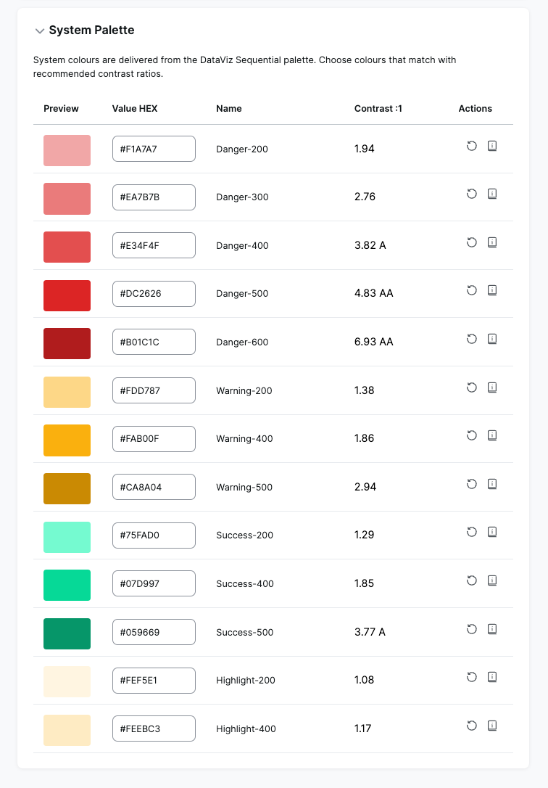

## Select typography

Using the drop-down, select a font already available in the OS or upload your own, and then select it from the menu.

:::important
To upload more than one custom font, group the files by font family. If you upload files that belong to different font families together, they will not be uploaded correctly.
:::

Then, configure the available typography elements.

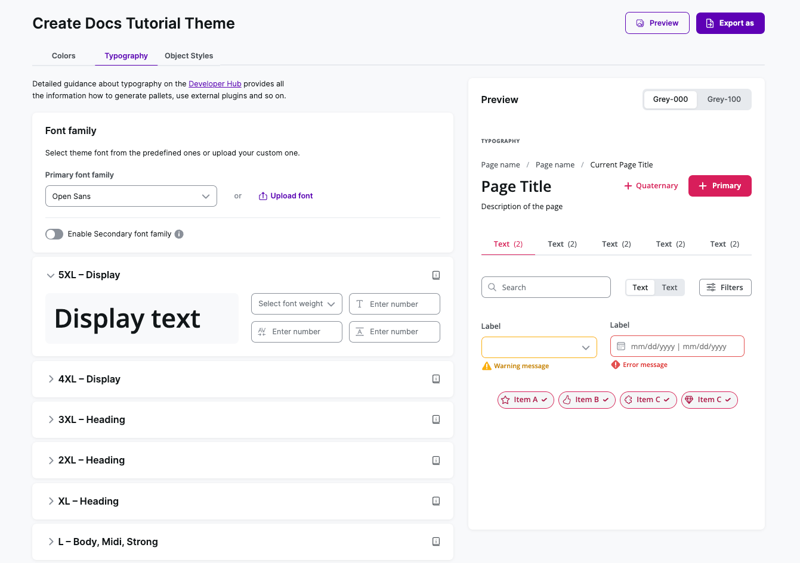

## Configure object styles

By changing the default values, you can update all components' border radius and box shadow.

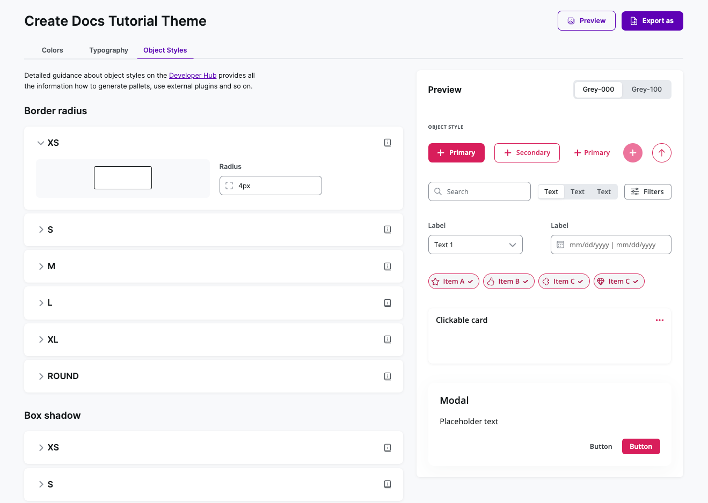

## Preview and export

Once you're done creating a theme, select **Preview** to see how it can look when implemented for your tenant.

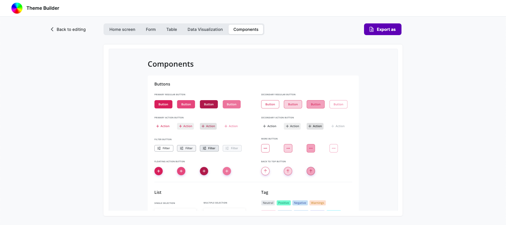

If everything looks as expected, select **Export as** to export your theme as:

- PDF that contains all previews.
- JSON that contains the theme config.
- CSS that contains styles.
- Archive that contains all of the above.

We recommend exporting the whole archive to ensure you have all the necessary theme resources.

## Next steps

To implement your theme for a specific tenant, provide the respective Tenant Admin with the theme JSON file and, if you used custom fonts, all of the files related to that font.
